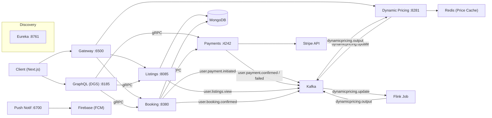
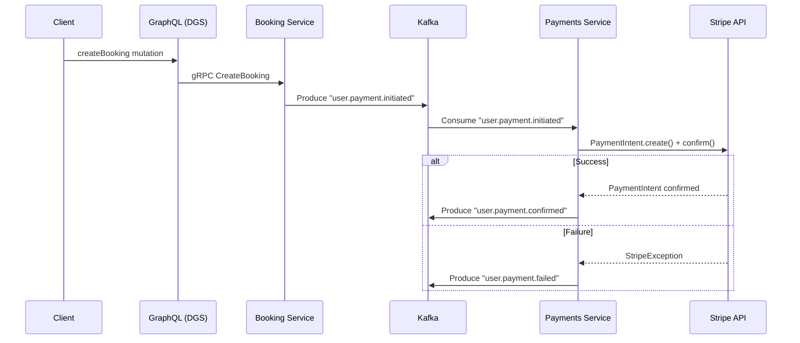

# Rentaroost — Event-Driven Real Estate Ecosystem

An event-driven microservices platform for rental property management, featuring Kafka-choreographed booking flows, Apache Flink dynamic pricing, Stripe payment integration, and a Netflix DGS GraphQL API layer.

---

## System Architecture

The Rentaroost ecosystem consists of 9 specialized services communicating via gRPC for synchronous retrieval and Kafka for asynchronous choreography.



---

## Service Catalog

| Service | Port | Tech Stack | Responsibility |
|---|---|---|---|
| `gateway` | 6500 | Spring Cloud Gateway | Edge routing, Admin UI (Thymeleaf), Pricing Proxy |
| `graphql` | 8185 | Netflix DGS 9.0, gRPC | Federated API layer, Query aggregation |
| `listings-service` | 8085 | Spring Boot, MongoDB | Property management, Reactive data access |
| `booking-service` | 8380 | Spring Boot, Kafka, gRPC | Transactional lifecycle, Saga participant |
| `payments-service` | 4242 | Stripe SDK, Kafka | Payment intent lifecycle, Webhook orchestration |
| `dynamic-pricing-service` | 8281 | Spring Boot, Redis, Kafka | Flink bridge, Real-time pricing cache |
| `dynamic-pricing-flink-job` | — | Apache Flink 1.19 | Stream processing, Windowed demand sensing |
| `push-notification-service`| 6700 | Firebase Admin SDK | Topic-based messaging, FCM delivery |
| `discovery-service` | 8761 | Netflix Eureka | Service registry and health monitoring |

---

## Technical Deep Dives

### Kafka Event Choreography
Rentaroost uses a choreography-based Saga pattern for distributed consistency across booking and payment boundaries.

**Key Topics:**
- `user.payment.initiated`: Triggers Stripe payment intent creation.
- `user.payment.confirmed`: Signals successful payment to the booking service.
- `user.payment.failed`: Triggers compensation logic/rejection.
- `dynamicpricing.update`: Feeds user interactions (views/bookings) to Flink.



### Flink Dynamic Pricing Engine
The system uses **Apache Flink** to compute real-time price adjustments based on demand signals.

- **Windowing Strategy**: Sliding Event Time Windows (30m duration, 1m slide).
- **Deduplication**: Per-window deduping by `userID + eventType` to prevent price manipulation.
- **Algorithm**: `BASE_PRICE × ImpactFactors`.
    - `Booking_Impact`: +10% per unique booking event.
    - `View_Impact`: +5% per unique view event.
- **Sink**: Results are pushed to `dynamicpricing.output` and cached in **Redis** with a 30-minute TTL.

---

## Getting Started

### Prerequisites
- Docker & Docker Compose
- Java 21 (for local builds)
- Maven (for Flink jobs)

### Quick Start
1. **Clone the repository**:
   ```bash
   git clone https://github.com/bellerophon95/rentaroost.git
   cd rentaroost
   ```

2. **Launch Infrastructure & Services**:
   ```bash
   docker-compose up -d --build
   ```

3. **Seed Initial Data**:
   ```bash
   ./seed_data.sh
   ```

### Access Points
- **Admin Dashboard**: `http://localhost:6500`
- **GraphiQL IDE**: `http://localhost:8185/graphiql`
- **Service Registry (Eureka)**: `http://localhost:8761`

---

## Infrastructure Note
The production infrastructure for this ecosystem requires managed Kafka and Flink clusters. For evaluation, the included `docker-compose.yaml` provides a fully functional local environment including Zookeeper, Kafka, Redis, and a Flink JobManager.
